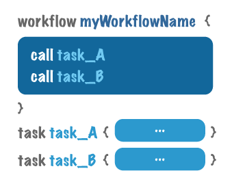
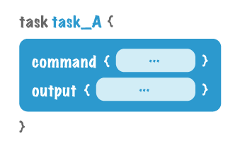

基础结构
=========

有5个基本组件组成了WDL脚本的核心结构:workflow、task、call、command和output。没有明确命名的“input”定义组件; input变量(用于指定参数以及输入和输出文件名)将被单独定义，我们将在下面进一步看到。您还可以使用一些可选组件来指定runtime参数(如环境条件，如Docker图像)、meta information(如任务作者和电子邮件)和parameter_meta参数描述输入和输出——但我们现在不打算考虑它们。

让我们来看看核心组件是如何在一个最小的WDL脚本中构造的，该脚本描述了一个名为myWorkflowName的工作流和两个任务task_A和task_B(名称可以是任何您想要的名称，不必包含单词“task”或“workflow”)。为了让事情变得简单，我们假设所有的参数、输入和输出文件名都是硬编码的(意味着实际的文件名和参数值是在脚本本身中编写的)，并且没有变量。我们将在下一个步骤中看到如何向这个基本结构添加变量。

顶级组件:workflow, task and call
---------------------------------

在顶层，我们定义一个工作流，在这个工作流中我们调用一组任务。请注意，任务是在工作流块外部定义的，而调用语句是在工作流块内部定义的。

工作流块和任务定义在脚本中的排列顺序并不重要。调用语句的顺序也不重要，我们将在后面看到。

call
^^^^^

task
^^^^^

workflow
^^^^^^^^^

核心任务级组件:command and output
----------------------------------

如果我们查看任务定义的内部，我们会发现它的核心组件:将要运行的命令，它可以是在终端shell中运行的任何命令行，以及一个输出定义，它显式地标识命令的哪一部分构成了它的输出。

command
^^^^^^^^

output
^^^^^^^

可以看到，WDL脚本的基本结构相当简单。在下一节中，我们将通过添加变量而不是假设输入和输出名称以及所有参数都是硬编码的方式使其更加实际。

