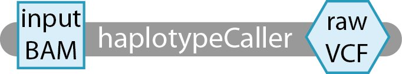
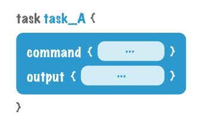
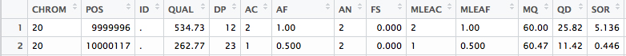

[1] (howto) 编写运行GATK HaplotypeCaller的第一个WDL脚本
========================================================

**Requirements**

本教程假设您对GATK工具有(非常)基本的了解，并阅读了入门指南。您还应该安装了必要的工具。最后，您需要下载包含本教程数据的zip包。我们将使用一个玩具数据集:NA12878, 20号染色体的子集。有关包中每个文件的详细描述，请参阅自述文件。

介绍
-----

在接下来的文本中，我们将逐步介绍如何创建第一个WDL脚本。现在，大多数人会从臭名昭著的“hello world”示例开始，但是我们更愿意通过一个更相关的示例进行介绍。在这里，我们将编写一个名为helloHaplotypeCaller的工作流;它由一个GATK的HaplotypeCaller的单一task组成。这个工具对高通量测序数据进行变异发现。

从我们的图中可以看到，任务haplotypeCaller将接收一个文件inputBAM并输出一个文件rawVCF。它是一个一个任务的工作流，所以在这里没什么可看的。

所有的脚本写作都从一个高水平的草图开始，就像上面的那个，这样你就知道你的计划了。

写你自己的脚本
--------------

在您喜欢的文本编辑器中打开一个空白文本文件，并将该文件保存为helloHaplotypeCaller.wdl。(注意wdl文件扩展名——您的文本编辑器可能会告诉您使用txt，这是行不通的。)工作流和任务都将被写到这个文件中。

Workflow
^^^^^^^^^

我们的首要任务是概述我们的工作流程(workflow)。工作流(workflow)是您将调用(call)每个任务(task)并指定其调用顺序的地方。在本例中，我们只有一个任务，即haplotypeCaller，因此工作流将非常简单。声明你的工作流程和调用你的任务，像这样:

  :: 

	workflow helloHaplotypeCaller {
	  call haplotypeCaller
	}

简单,是吧?我们接着做我们的task吧。

Task
^^^^^

**haplotypeCaller**

任务本质上是打包工具命令的盒子，因此它可以被执行引擎(在我们的例子中是Cromwell)解释。为了知道我们想在WDL中写什么，让我们首先看看如何将这个命令输入到终端。HaplotypeCaller有许多可能的规范，但是为了简单起见，我们将在正常模式下运行该工具。

  :: 

	java -jar GenomeAnalysisTK.jar \
	      -T HaplotypeCaller \
	      -R reference.fasta \
	      -I input.bam \
	      -o output.vcf \

在该声明中，我们需要提供一些项作为命令的输入:reference.fasta、input.bam、output.vcf和GenomeAnalysisTK.jar。与简单地提供绝对引用(绝对引用应该是/User/username/input.bam)不同，我们在运行该命令时将为每个输入提供一个变量名。其中三个输入是文件，因此我们将在任务的输入部分中分别将变量声明为文件RefFasta、文件inputBAM和文件GATK。最后的输入output.vcf是一个文件名，一旦命令运行，输出将被写入该文件名。因此，我们将提供一个字符串sampleName来命名输出文件。将以下文本置于相同的helloHaplotypeCaller.wdl文件中的工作流声明之下。

  :: 

	task haplotypeCaller {
	  File GATK
	  File RefFasta
	  String sampleName
	  File inputBAM
	}

这些是我们完成这项任务(task)所需要的核心input。但是，GATK会自动查找支持文件(索引和字典作为参考，以及bam的索引)。为了让克伦威尔将这些支持文件放入工作目录，我们需要为每个文件声明变量:

  :: 

	task haplotypeCaller {
	  File GATK
	  File RefFasta
	  File RefIndex
	  File RefDict
	  String sampleName
	  File inputBAM
	  File bamIndex
	}

现在我们可以进入task的下一个组件，command。我们已经看到了命令在bash终端中正常运行时的样子，但是现在我们需要在WDL中编写它。我们已经声明了变量，所以只需将它们插入command的正确位置即可。要调用WDL中的变量，使用${variablename}语法。例如，GATK变量可以写成java -jar ${GATK}。将每个变量插入正确的位置(除了GATK知道自动查找的索引和字典之外)，并将命令放入任务的命令组件中。

  :: 

	task haplotypeCaller {
	  File GATK
	  File RefFasta
	  File RefIndex
	  File RefDict
	  String sampleName
	  File inputBAM
	  File bamIndex
	  command {
	   java -jar ${GATK} \
		-T HaplotypeCaller \
		-R ${RefFasta} \
		-I ${inputBAM} \
		-o ${sampleName}.raw.indels.snps.vcf
	  }
	}

快到了!编写任务最后需要的组件是output。现在，您可能想知道:“我们不是已经声明了一个输出吗?就在-o后面!是的，该工具有一个输出，由-o指定，但是为了让执行引擎识别输出(这对于管道很重要，我们在输出{…}组件中显式地指定它们)。您将在以后的教程中看到实际的管道，但是现在我们只是使用格式类型outputVariable = " output_from_command "来分配输出。在我们的例子中，输出组件看起来是这样的:

  :: 

	  output {
	    File rawVCF = "${sampleName}.raw.indels.snps.vcf"
	  }

在命令下面的任务中添加该部分，您就有了一个完整的WDL脚本。如果你一直在遵循，你的脚本应该是这样的:

  :: 

	workflow helloHaplotypeCaller {
	  call haplotypeCaller
	}

	task haplotypeCaller {
	  File GATK
	  File RefFasta
	  File RefIndex
	  File RefDict
	  String sampleName
	  File inputBAM
	  File bamIndex
	  command {
	    java -jar ${GATK} \
		-T HaplotypeCaller \
		-R ${RefFasta} \
		-I ${inputBAM} \
		-o ${sampleName}.raw.indels.snps.vcf
	  }
	  output {
	    File rawVCF = "${sampleName}.raw.indels.snps.vcf"
	  }
	}

运行管道
^^^^^^^^^

在运行WDL脚本之前，最好先验证它。无论您的脚本是简单的还是复杂的，这一步都是有用的，因为它将在您运行它之前捕获任何愚蠢的语法错误。

下一步是生成一个输入文件。我们使用以下命令:

  :: 

    java -jar wdltool.jar inputs helloHaplotypeCaller.wdl > helloHaplotypeCaller_inputs.json

现在您应该在文本编辑器中打开helloHaplotypeCaller_inputs.json文件。此文本编辑器可能不是默认选项，或在快速菜单中显示为选项。对于大多数操作系统，您可以右击并打开，或者打开以导航到您选择的文本编辑器程序。文件扩展名、wdl和json并不总是可识别的，但它们将使用文本编辑器打开。

在输入文件中，您将看到需要指定的每个输入的单行条目。它们的格式如下:

  :: 

    "workflow.task.variable" : "Type"

用文件的绝对路径或字符串替换Type。以RefFasta为例:

  :: 

    "helloHaplotypeCaller.haplotypeCaller.RefFasta" : ".../helloHaplotypeCallerBundle/ref/human_g1k_b37_20.fasta"

除了两个输入(sampleName和gatk)之外，您将在附加的包中找到所有输入。我们数据的样本名称是“NA12878”。对于GATK，您应该指定本地安装的绝对路径(即/usr/ document / genomeanalysistk .jar，而不是$ GATK)

有了你完成的输入文件，你现在可以在本地运行你的脚本(即在你自己的电脑上)。我们将使用以下命令运行:

  :: 

    java -jar cromwell.jar run helloHaplotypeCaller.wdl -i helloHaplotypeCaller_inputs.json

当您这样做时，Cromwell应该开始打印更新消息到您的终端，直到工作流程完成。

.. note:: 
	注意，这个命令反映了Cromwell版本29+使用的语法。早期版本使用以下语法:

	  :: 

	    java -jar cromwell.jar run helloHaplotypeCaller.wdl helloHaplotypeCaller_inputs.json

检查你的结果
-------------

终端会在最后打印出你最终输出的位置。它应该看起来像这样:

  :: 

	{
	    "helloHaplotypeCaller.haplotypeCaller.rawVCF": "/Users/username/cromwell-executions/helloHaplotypeCaller/2eae3da2-fb3f-4f26-bc6b-1745a5a077cd/call-haplotypeCaller/NA12878.raw.indels.snps.vcf"
	}

不要被文件结构中间的一长串数字和字母吓到。这是一个散列，用于在每次运行此工作流时唯一地标识它。有了它，您就不会在每次运行时意外地覆盖文件。继续并打开那个vcf文件来查看它。您可以通过使用more命令来实现这一点。

  :: 

    more /Users/username/cromwell-executions/helloHaplotypeCaller/2eae3da2-fb3f-4f26-bc6b-1745a5a077cd/call-haplotypeCaller/NA12878.raw.indels.snps.vcf

这将把VCF的前几行打印到终端。单击return键向下滚动文件，直到看到前几个变量调用。它们应该是这样的:

  :: 

	#CHROM  POS     ID      REF     ALT     QUAL    FILTER  INFO    FORMAT  NA12878
	20      9999996 .       A       ACT     534.73  .       AC=2;AF=1.00;AN=2;DP=12;FS=0.000;MLEAC=2;MLEAF=1.00;MQ=60.00;QD=25.82;SOR=5.136 GT:AD:DP:GQ:PL  1/1:0,12:12:39:572,39,0
	20      10000117        .       C       T       262.77  .       AC=1;AF=0.500;AN=2;BaseQRankSum=-0.831;ClippingRankSum=0.092;DP=23;FS=0.000;MLEAC=1;MLEAF=0.500;MQ=60.47;MQRankSum=-0.769;QD=11.42;ReadPosRankSum=0.769;SOR=0.446       GT:AD:DP:GQ:PL  0/1:11,12:23:99:291,0,292

如果你觉得它有点难读，你并不孤单。GATK有一个叫做VariantsToTable的工具，它的设计目的是使vcf的格式更具可读性。你可以在这里阅读更多关于如何使用这个工具的信息。

如果您想更深入地查看结果以进行比较，那么表文件和vcf都在包的输出文件夹中。应该指出，在GATK版本之间，输出可能略有不同。

恭喜你!您已经运行了您的第一个WDL脚本!在下一篇教程中，您将学习如何扩展这里编写的脚本。它将教授工作流管道的分支语法、传递变量的重要性，以及如何编写多任务WDL脚本。
